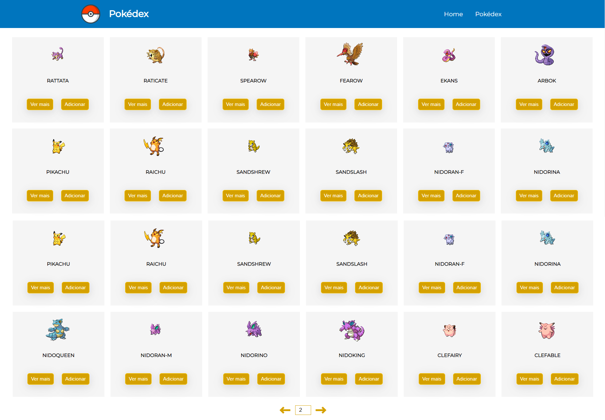

<h1 align="center">Pokédex</h1>

##  ℹ️Sobre
Este projeto foi desenvolvido como parte da fixação do conteúdo sobre React.js aprendido no bootcamp de Desenvolvimento Web Full Stack da Labenu. Foi realizado utilizando a API pública PokéAPI. O projeto consiste em uma aplicação aonde o usuário pode visualizar todos os tipos de Pokémons, e incluí-los em sua Pokédex. Na página inicial, é possível visualizar uma lista de Pokémons, selecioná-los para ver seus detalhes (abrir página de detalhes) e adicioná-los em sua Pokédex. Já na página Pokédex, também é possível clicar para ver os detalhes do Pokémon, removê-lo da Pokédex e iniciar uma batalha entre os Pokémons que estão na Pokédex. O site possui uma versão adaptada para Mobile, para melhor visualização em telas verticais e menores.

##  👩‍💻Desenvolvedoras
- <a href="https://github.com/francinehahn" target="_blank">
Francine Hahn
</a>
- <a href="https://github.com/gioivieira" target="_blank">
Giovana Inez Vieira
</a>
- <a href="https://github.com/mariafmf" target="_blank">
Maria Fernandez de Moura Ferro
</a>

## 🔗Link para acessar
https://naive-mother.surge.sh/

## ☑️Requisitos de funcionalidade
- Requisição de todos os pokémons disponíveis na API;
- Botão "adicionar à pokédex" e "ver mais" em cada card de pokémon;
- Ao adicionar pokémon à pokédex, ele fica salvo no local storage e deixa de ser renderizado na página inicial;
- Botão "remover da pokédex": pokémon deixa de ser renderizado na pokédex e volta para a página inicial;
- Botão "limpar pokédex": exclui todos os pokémons da pokédex;
- Botão "iniciar batalha": usuário pode selecionar 2 pokémons para se enfrentar; o pokémon com maior soma das stats vence;

## 🛰Rodando o projeto

1. git clone https://github.com/gioivieira/projeto-pokedex.git 
2. cd projeto-pokedex 
3. npm install
4. npm run dev 

## 💻Tecnologias utilizadas
- React.js
- Styled-Components

## 📷Imagens

## 📝Sobre a licença

Este projeto está licenciado nos termos da licença [MIT](./LICENSE).

